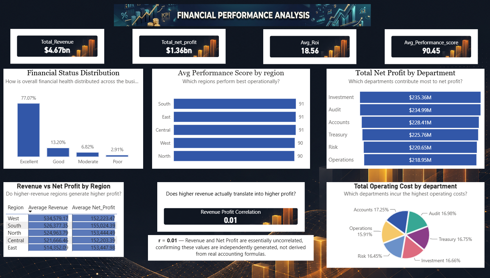

# Financial Performance Dashboard — Power BI Report

## 1. Project Overview
- **Dataset:** Financial Performance Dataset (Kaggle, 8,900 records, 38 columns)
- **Data Source:** Neon (PostgreSQL) → imported into Power BI Desktop
- **Prior Stage:** SQL exploration & cleaning (see `README_SQL_Analysis.md`)
- **This Stage:** 3-page Power BI dashboard — Financial Performance, Risk & Compliance, Operational/IoT Metrics

---

## 2. Executive Summary

Analysis of 8,900 financial transactions across 5 regions and 6 departments reveals a synthetic, feature-independent dataset: Revenue and Net Profit show no correlation (r = 0.01), ruling out real P&L relationships. The strongest genuine pattern is Fraud Risk rising with declining Financial Status (0.46→0.76). Operational infrastructure (uptime, latency) is centrally managed and uniform across regions, while 77% of records fall in "Excellent" financial status.

---

## 3. Dashboard Pages — Screenshots

### Page 1: Financial Performance Analysis
 

### Page 2: Risk & Compliance Analysis
![Risk & Compliance Analysis].(/images/risk_analysis.PNG).

### Page 3: Operational Analysis / IoT Metrics
📸 **[Insert screenshot: Page 3 — Operational/IoT]**

---

## 4. Data Connection
- Connected via **PostgreSQL connector** (Npgsql driver) using Neon server + database credentials
- Import mode used (not DirectQuery)
- Single flat table: `financial_management`

---

## 5. KPI Measures Created

```dax
Total Revenue = SUM(financial_management[revenue])
Total Net Profit = SUM(financial_management[net_profit])
Total Operating Cost = SUM(financial_management[operating_cost])
Avg ROI = AVERAGE(financial_management[roi])
Avg Gross Margin = AVERAGE(financial_management[gross_margin])
Avg Performance Score = AVERAGE(financial_management[performance_score])
Total Transactions = COUNTROWS(financial_management)
Avg EBITDA = AVERAGE(financial_management[ebitda])

Revenue Profit Correlation = 
VAR __CORR = 
    (SUMX(financial_management, (financial_management[revenue] - AVERAGE(financial_management[revenue])) * (financial_management[net_profit] - AVERAGE(financial_management[net_profit]))))
    /
    (SQRT(SUMX(financial_management, (financial_management[revenue] - AVERAGE(financial_management[revenue]))^2)) * SQRT(SUMX(financial_management, (financial_management[net_profit] - AVERAGE(financial_management[net_profit]))^2)))
RETURN __CORR
```

---

## 6. Dashboard Visuals by Page

### Page 1 — Financial Performance
| Visual | Question | Insight |
|---|---|---|
| Financial Status Distribution (donut) | How is overall financial health distributed? | Excellent 77%, Good 13%, Moderate 7%, Poor <3% |
| Avg Performance Score by Region | Which regions perform best operationally? | All regions cluster 90-91 — minimal variation |
| Total Net Profit by Department | Which departments contribute most to net profit? | Investment ($235M) and Audit ($235M) lead; Operations lowest ($219M) |
| Total Operating Cost by Department | Which departments incur the highest costs? | Accounts (17.3%) highest; Operations (15.9%) lowest |
| Revenue vs Net Profit by Region (table) | Do higher-revenue regions generate higher profit? | West has highest revenue (534K) but not highest profit (152K) — no relationship |
| Revenue–Profit Correlation (card) | Does higher revenue translate into higher profit? | **r = 0.01** — essentially uncorrelated |

### Page 2 — Risk & Compliance
| Visual | Question | Insight |
|---|---|---|
| Region vs Avg Fraud Risk | Which regions carry the highest fraud risk? | Flat across regions (0.50-0.51) — no regional signal |
| Avg Compliance Score by Department | Which departments are weakest on compliance? | Flat across departments (79.7-80.3) — no departmental signal |
| Total Security Breaches by Region (pie) | Where are breach attempts concentrated? | Evenly distributed (~19-21% each) — no region disproportionately targeted |
| Financial_Status vs Avg Fraud Risk & Anomaly Score (table) | Does poor financial status correlate with higher risk? | **Yes** — Fraud Risk rises consistently: Excellent 0.46 → Good 0.61 → Moderate 0.66 → Poor 0.76 |

### Page 3 — Operational Analysis / IoT Metrics
| Visual | Question | Insight |
|---|---|---|
| Avg System Uptime by Region | Which regions have the most reliable systems? | Uniform at 95% across all regions |
| Avg ERP Response Time by Department | Which departments face the slowest response? | Narrow range (119-121ms) — negligible difference |
| Network Latency & Device Error Rate by Region | Do high-latency regions have more device errors? | Both flat across regions (35ms latency, 5% error rate) |
| Financial_Status vs Avg Automation Efficiency (table) | Does automation relate to financial status? | **Yes** — Efficiency drops with status: Excellent 75.9 → Poor 64.1 |

📸 **[Insert screenshots per page — see Section 3]**

---

## 7. Key Findings Summary

| Finding | Evidence |
|---|---|
| Dataset is synthetic, not real accounting data | 993 rows with Net_Profit > Revenue; r = 0.01 correlation |
| Revenue does not predict profitability | Revenue rises by region while profit stays flat |
| Fraud risk is the strongest real signal in the dataset | Rises consistently with declining financial status (0.46→0.76) |
| Automation efficiency also tracks financial status | Drops from 75.9 (Excellent) to 64.1 (Poor) |
| Operational infrastructure is centrally managed | Uptime, latency, error rate near-identical across all regions |
| Regional/departmental risk & compliance differences are negligible | Fraud risk, compliance score, breach share all flat across regions/departments |
| No nulls, no duplicate transactions | SQL integrity checks (Stage 1) |

---

## 8. Recommendations
1. Treat each financial metric (Revenue, Net Profit, ROI, Gross Margin, EBITDA) as an **independent KPI** — do not build logic assuming they reconcile.
2. Prioritize **Financial_Status** as the key segmentation variable — it's the only field showing consistent relationships with Fraud Risk and Automation Efficiency.
3. Do not over-interpret region/department differences in operational or compliance metrics — they fall within statistical noise.
4. Use this dataset for **pattern recognition and benchmarking** (e.g. status-based risk scoring), not real P&L or infrastructure-planning analysis.
5. Clearly label the dashboard/report for stakeholders as based on a **synthetic dataset**, to avoid it being mistaken for real company financials.

---

## 9. Status
All 3 dashboard pages complete (Financial Performance, Risk & Compliance, Operational/IoT Metrics). Dashboard connects live to Neon PostgreSQL. Ready for portfolio presentation and stakeholder review.
