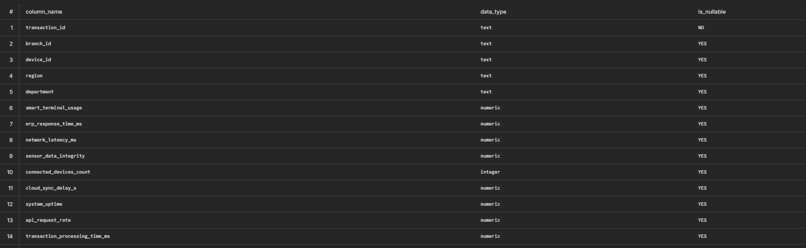
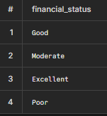
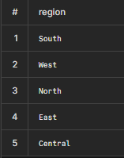

# Financial Performance Dataset — SQL Exploration & Cleaning

## 1. Project Overview
- **Dataset:** Financial Performance Dataset (Kaggle)
- **Rows:** 8,900
- **Columns:** 38
- **Tool:** PostgreSQL
- **Goal:** Explore, validate, and clean the dataset before moving into Power BI / Tableau for visualization and analysis.

---

## 2. Table Setup

```sql
CREATE TABLE financial_management (
    transaction_id TEXT,
    branch_id TEXT,
    device_id TEXT,
    region TEXT,
    department TEXT,
    smart_terminal_usage NUMERIC,
    erp_response_time_ms NUMERIC,
    network_latency_ms NUMERIC,
    sensor_data_integrity NUMERIC,
    connected_devices_count INT,
    cloud_sync_delay_s NUMERIC,
    system_uptime NUMERIC,
    api_request_rate NUMERIC,
    transaction_processing_time_ms NUMERIC,
    device_error_rate NUMERIC,
    revenue NUMERIC,
    net_profit NUMERIC,
    operating_cost NUMERIC,
    gross_margin NUMERIC,
    roi NUMERIC,
    ebitda NUMERIC,
    current_ratio NUMERIC,
    quick_ratio NUMERIC,
    cash_flow NUMERIC,
    working_capital NUMERIC,
    debt_to_equity NUMERIC,
    resource_utilization NUMERIC,
    energy_consumption_kwh NUMERIC,
    maintenance_cost NUMERIC,
    transaction_cost NUMERIC,
    automation_efficiency NUMERIC,
    fraud_risk_score NUMERIC,
    credit_risk_level NUMERIC,
    security_breach_attempts INT,
    compliance_score NUMERIC,
    market_volatility_index NUMERIC,
    anomaly_score NUMERIC,
    performance_score NUMERIC,
    financial_status TEXT
);
```

**Note:** `credit_risk_level` was initially typed as `TEXT` but corrected to `NUMERIC` after inspecting sample values (e.g. 0.366, 0.231, 0.163) which were clearly continuous risk scores, not categorical labels.

```sql
ALTER TABLE financial_management 
ALTER COLUMN credit_risk_level TYPE NUMERIC USING credit_risk_level::NUMERIC;
```

---

## 3. Data Integrity Checks

### 3.1 Duplicate Check
```sql
SELECT transaction_id, COUNT(*)
FROM financial_management
GROUP BY transaction_id
HAVING COUNT(*) > 1;
```
**Result:** 0 duplicate transaction IDs found. All 8,900 records are unique.

### 3.2 Missing Primary Key Check
```sql
SELECT COUNT(*)
FROM financial_management
WHERE transaction_id IS NULL OR transaction_id = '';
```
**Result:** 0 missing/blank transaction IDs.

### 3.3 Primary Key Enforcement
```sql
ALTER TABLE financial_management ADD PRIMARY KEY (transaction_id);
```
**Result:** Constraint applied successfully — confirms `transaction_id` is a valid unique row identifier.

📸 

---

## 4. Null Value Check

```sql
SELECT
  COUNT(*) FILTER (WHERE revenue IS NULL) AS null_revenue,
  COUNT(*) FILTER (WHERE net_profit IS NULL) AS null_profit,
  COUNT(*) FILTER (WHERE gross_margin IS NULL) AS null_margin,
  COUNT(*) FILTER (WHERE financial_status IS NULL) AS null_status,
  COUNT(*) FILTER (WHERE region IS NULL) AS null_region
FROM financial_management;
```
**Result:** 0 nulls across all key columns. Dataset is complete with no missing values.

---

## 5. Categorical Value Validation

```sql
SELECT DISTINCT financial_status FROM financial_management;
SELECT DISTINCT region FROM financial_management;
SELECT DISTINCT department FROM financial_management;
```
**Result:** All categorical fields (`financial_status`, `region`, `department`) contain clean, consistent values — no typos, casing issues, or unexpected categories.

📸   


---

## 6. Numeric Range Validation

```sql
SELECT
  MIN(revenue), MAX(revenue),
  MIN(gross_margin), MAX(gross_margin),
  MIN(roi), MAX(roi),
  MIN(system_uptime), MAX(system_uptime),
  MIN(current_ratio), MAX(current_ratio),
  MIN(debt_to_equity), MAX(debt_to_equity)
FROM financial_management;
```

| Metric | Min | Max |
|---|---|---|
| Revenue | 50,049.83 | 999,869.43 |
| Gross Margin (%) | 10.0 | 65.0 |
| ROI (%) | 2.0 | 35.0 |
| System Uptime (%) | 90.0 | 100.0 |
| Current Ratio | 0.8 | 4.5 |
| Debt-to-Equity | 0.1 | 3.5 |

**Result:** All ranges fall within plausible real-world bounds. No impossible or corrupted values (e.g. negative percentages, uptime over 100%).

📸 **[Insert screenshot: MIN/MAX query results]**

*Outlier detection (IQR/percentile analysis) deferred intentionally to the visualization stage (Power BI/Tableau boxplots) and potential later ML stage, where distribution shape is easier to interpret visually.*

---

## 7. Logical Consistency Check — Key Finding

```sql
SELECT COUNT(*) FROM financial_management WHERE net_profit > revenue;
```
**Result:** 993 rows (≈ 11.2% of the dataset) have `net_profit > revenue`.

### Investigation
Sample rows were pulled to inspect the relationship between `revenue`, `operating_cost`, and `net_profit`:

📸 **[Insert screenshot: sample rows where net_profit > revenue]**

| transaction_id | revenue | operating_cost | net_profit |
|---|---|---|---|
| TXN100013 | 56,706.62 | 456,715.11 | 76,326.93 |
| TXN100024 | 114,468.81 | 39,709.83 | 220,744.13 |
| TXN100031 | 283,160.48 | 460,896.95 | 287,565.39 |

Gap analysis:
```sql
SELECT
  MIN(net_profit - revenue) AS smallest_gap,
  MAX(net_profit - revenue) AS largest_gap,
  AVG(net_profit - revenue) AS avg_gap
FROM financial_management
WHERE net_profit > revenue;
```
**Result:** Gaps range from 61.62 to 239,950.56 (avg ≈ 81,373). The scale of inconsistency (e.g. operating cost 8x revenue while net profit is still positive) confirms this isn't rounding error — it's structural.

📸 **[Insert screenshot: gap analysis results]**

### Conclusion
`revenue`, `operating_cost`, and `net_profit` (and likely `gross_margin`, `roi`, `ebitda`) are **independently generated synthetic values**, not values derived from real accounting formulas. This is expected behavior for this dataset and **not a data quality error**.

---

## 8. Recommendations

1. **Do not treat financial fields as reconciling.** Avoid building any Power BI/Tableau calculation or validation that assumes `Revenue − Operating_Cost = Net_Profit`. It will not hold and is not a bug.
2. **Do not remove the 993 "inconsistent" rows.** They are not corrupt — deleting them would discard ~11% of data for no analytical benefit.
3. **Treat each financial metric as an independent KPI.** Analyze `revenue`, `net_profit`, `roi`, `gross_margin`, etc. individually or via correlation analysis — not as a derived P&L.
4. **Document this limitation explicitly** in the final report/dashboard notes, so stakeholders don't misread the dashboard as real financial statement data.
5. **Save outlier and distribution analysis for the BI/visualization stage**, where boxplots and histograms will make skew and extreme values easier to identify and act on than raw SQL percentile queries.
6. **This dataset is best framed as a pattern-recognition / operational-monitoring dataset** (IoT + financial performance indicators) rather than a real corporate financial statement dataset.

---

## 9. Status: Ready for BI Tool
Data is deduplicated, has a valid primary key, contains no nulls, has clean categorical values, and numeric ranges are plausible. Known synthetic-data limitation is documented above. Proceeding to Power BI / Tableau for visualization and deeper analysis.
