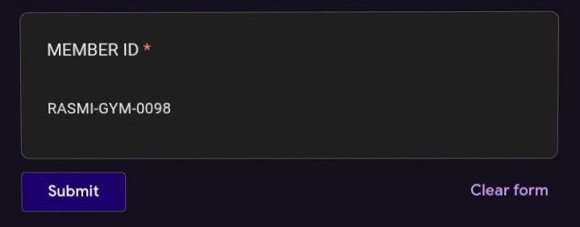
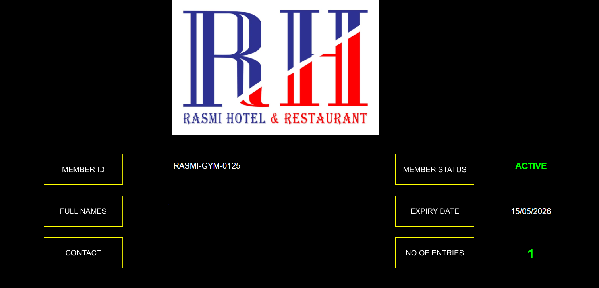
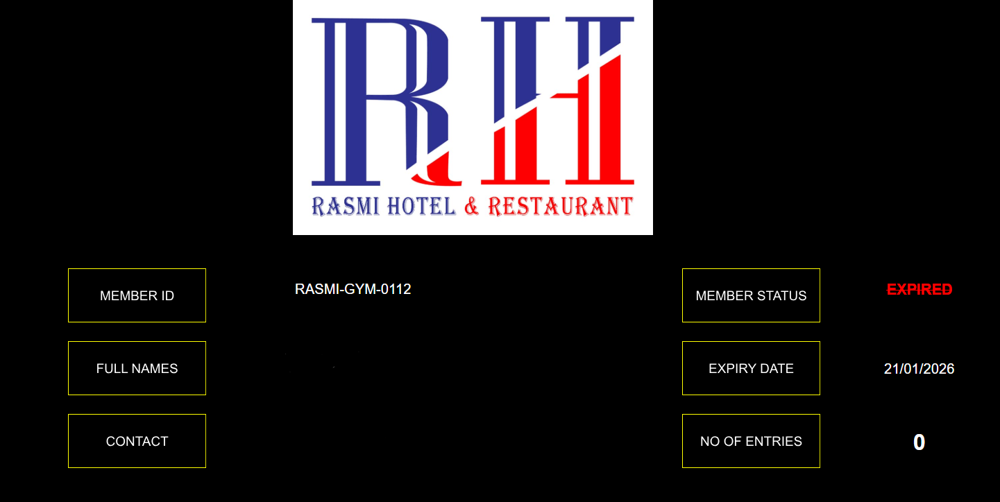
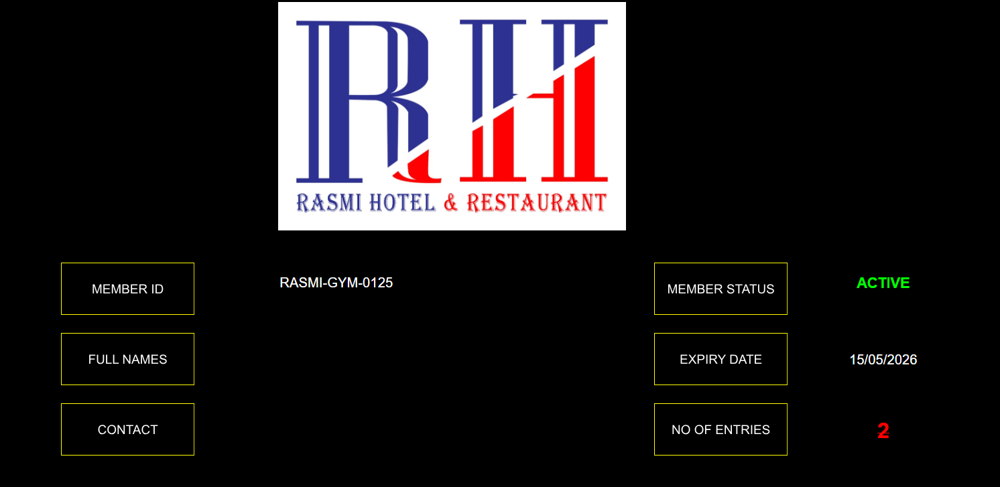

# 🏋️ Gym Tracker

### QR-Based Gym Access & Attendance System

**Developed by:** Abdigani Mohamed
**Role:** Data Analyst / Data Engineer Associate
**Status:** ✅ Live & Operational

---

## 🚨 The Problem

Most gyms rely on biometric systems or manual check-ins, which create serious operational issues:

* Unauthorized access (members sharing entry)
* Expensive hardware and maintenance
* Device failures in sweaty gym environments
* Privacy concerns with fingerprint/face data
* No real-time attendance visibility

---

## 💡 The Solution

**Gym Tracker** replaces biometric systems with a **QR-based, cloud-powered access system** using Google Workspace.

✔ No hardware
✔ No biometrics
✔ No maintenance headaches
✔ Fully smartphone-based

Each member receives a **unique QR code** linked to their membership record.

---

## 🔄 How the System Works (End-to-End)

### 1. QR Code Scanning at Gym Entry

A gym staff member scans the member’s QR code using a smartphone.

---

### 2. Automated Check-In via Google Form

* A Google Form opens instantly
* Member ID is **auto-filled**
* Staff submits the check-in in seconds

---

### 3. Real-Time Membership Validation (Active)

The system checks:

* Membership status
* Expiry date

If valid → ✅ **Access Granted**

---

### 4. Expired Membership Detection

If the membership is expired:

* System flags the user
* Prevents unauthorized access

❌ **Access Denied**

---

### 5. Duplicate Check-In Detection (Fraud Prevention)

The system automatically detects:

* Multiple entries from the same member
* Within the same day

🚫 Prevents QR code sharing and abuse

---

## ⚙️ Key Features

* 🔐 Unique QR Code per Member
* 📅 Real-Time Expiry Validation
* 📊 Automated Attendance Logging
* 🚫 Fraud & Duplicate Entry Detection
* ☁️ Fully Cloud-Based (No Hardware)

---

## 🛠 Technology Stack

* Google Sheets → Member Database
* Google Forms → Check-In Interface
* Google Apps Script → Automation Logic
* QR Code System → Member Identification

---

## 📈 Business Impact

| Feature        | Traditional Systems | Gym Tracker |
| -------------- | ------------------- | ----------- |
| Hardware Cost  | High                | Zero        |
| Setup Time     | Days                | Hours       |
| Maintenance    | Frequent            | Minimal     |
| Operating Cost | High                | Near Zero   |

---

## 🎯 Strategic Value

* Reduces revenue leakage
* Improves operational efficiency
* Enables data-driven decisions
* Enhances modern gym branding

---

## 📸 Screenshots Note

All screenshots use **sample/demo data** to protect user privacy.

---

## 🚀 Scalability

Gym Tracker is built for scale:

* Supports unlimited members
* Easily adaptable for multi-branch gyms
* Fully cloud-based architecture

---

## 👨‍💻 Author

**Abdigani Mohamed**
Data Analyst / Data Engineer Associate

---

## 📬 Contact

(https://www.linkedin.com/in/abdulleabdigani/)

---
