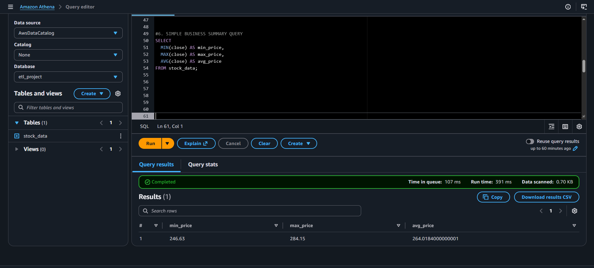

## 📊 Business Insights & Analysis

The processed stock dataset was analyzed using SQL queries in Amazon Athena to extract meaningful financial insights and support data-driven decision-making.

---

### 🔹 Key Insights

* **Average Market Price:**
  The stock maintained an average closing price of approximately **$264**, indicating a relatively stable trading range.

* **Price Extremes:**
  The highest recorded price was **$288.62 (Dec 3, 2025)**, while the lowest was **$243.42 (Jan 20, 2026)**.
  This reflects a moderate price spread and controlled market movement.

* **Volatility & Risk:**
  The average daily volatility was approximately **5.24**, with a peak of **15.54 (Feb 12, 2026)**.
  This indicates periods of increased market uncertainty and higher short-term risk.

* **High-Volatility Periods:**
  Volatility spikes were concentrated between **January and February 2026**, suggesting unstable trading conditions during this period.

* **Top Performance Days:**
  The highest daily return was **+4.06% (Feb 2, 2026)**, with several strong gains occurring between **late January and mid-February**, indicating short-term bullish momentum.

* **Market Activity (Liquidity):**
  The stock recorded an average daily trading volume of approximately **45 million shares**, highlighting strong liquidity and active market participation.

---

### 📸 Evidence (Athena Query Outputs)

* Top percentage return days:
  

* High volatility days:
  `images/volatility.png`

* Summary statistics (min, max, avg):
  
  

---

### 📈 Business Recommendations

* Use the **average price (~$264)** as a benchmark for evaluating entry and exit positions.
* Avoid trading during **extreme volatility spikes** unless operating under high-risk strategies.
* Focus on **momentum periods (late Jan – Feb)** for short-term trading opportunities.
* Combine **price movement (returns)** and **volatility metrics** to improve decision-making.
* Leverage **high trading volume** for efficient execution in active trading strategies.

---

### 🧾 Tools Used

* Amazon Athena for SQL-based analytics
* AWS S3 for data storage
* AWS Lambda for ETL processing

