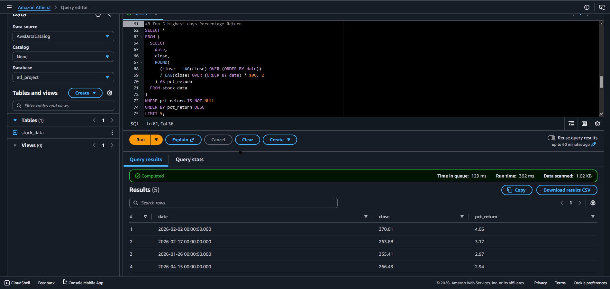
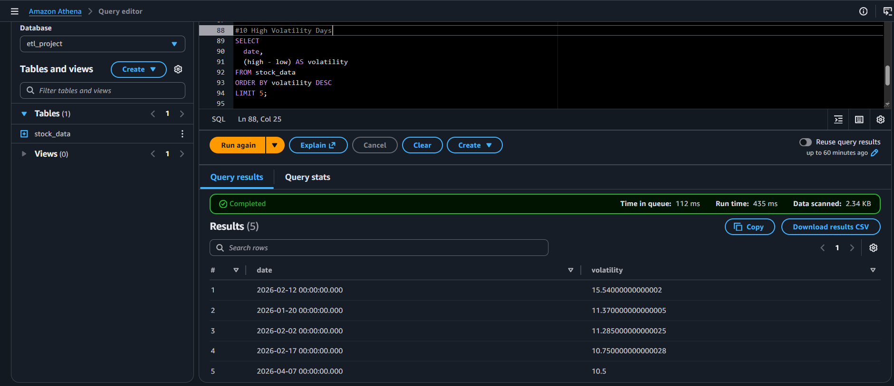

# 📊 Serverless Stock Data ETL Pipeline on AWS

## 📌 Project Overview

This project demonstrates a **serverless data engineering pipeline on AWS** that ingests, processes, and analyzes stock market data from a public API.

The pipeline automates the full ETL workflow:

**Stock API → AWS Lambda → Amazon S3 → AWS Athena → SQL Analytics**

It transforms raw financial data into structured Parquet format and enables business intelligence through SQL-based analysis.

---

## 🎯 Objective

To design and implement a scalable cloud-based ETL pipeline that:

* Automatically ingests stock market data from a public API
* Cleans and transforms raw JSON data into structured format
* Stores optimized Parquet files in Amazon S3
* Enables analytical querying using Amazon Athena
* Extracts actionable business insights from financial data

---

## 🏗️ Architecture

1. Stock Market API (Alpha Vantage)
2. AWS Lambda (Serverless data ingestion & transformation)
3. Amazon S3 (Raw and processed data storage)
4. Amazon Athena (SQL-based analytics engine)

---

## ⚙️ ETL Workflow

### 1. Data Ingestion

* Stock data is retrieved from the Alpha Vantage API
* AWS Lambda is triggered to fetch data automatically

### 2. Data Processing

* JSON response is parsed into structured format
* Data is cleaned using:

  * Null handling
  * Deduplication
  * Schema validation
  * Type conversion

### 3. Data Storage

* Cleaned dataset is converted into **Parquet format**
* Stored in Amazon S3 for optimized query performance

### 4. Data Analysis

* Amazon Athena is used for SQL-based analytics
* Data is analyzed for trends, returns, volatility, and trading behavior

---

## 📊 Business Insights & Analysis

The processed stock dataset was analyzed using SQL queries in Amazon Athena to extract meaningful financial insights and support data-driven decision-making.

---

### 🔹 Key Insights

* The stock maintained an average closing price of approximately **$264**, indicating a stable trading range.

* The price fluctuated between **$246.63 and $284.15**, showing a moderate range-bound market structure.

* The average daily volatility was **~5.24**, with a maximum spike of **15.54 (Feb 12, 2026)**, indicating occasional high-risk events.

* Volatility spikes were concentrated between **January and February 2026**, suggesting short-lived instability rather than sustained risk.

* The highest daily return was **+4.06% (Feb 2, 2026)**, with strong gains clustered in late January to mid-February, indicating momentum-based behavior.

* The stock recorded an average trading volume of **~45 million shares**, confirming strong liquidity and efficient market participation.

---

## 📈 Business Recommendations (Data-Driven)

* **Range-Based Trading Strategy:**
  The stock consistently traded within a defined range of **$246.63 to $284.15 (~14% spread)**, making mean-reversion strategies more suitable than long-term trend-following approaches.

* **Momentum Window Strategy:**
  Returns are not evenly distributed. The highest gains occurred in a concentrated period (late Jan – mid Feb), with a peak return of **+4.06%**, indicating that profitable opportunities exist in **short momentum clusters rather than random intervals**.

* **Risk-Controlled Volatility Strategy:**
  Although average volatility remained moderate (**~5.24**), sharp spikes up to **15.54** were observed. These are **event-driven risk periods**, suggesting traders should avoid entries during volatility spikes and instead focus on stable pre-spike conditions.

---

## 📸 Evidence (Query Outputs)

The following screenshots are included in the repository:

* Top percentage return days:
  

* High volatility days:
  

* Summary statistics (min, max, avg):
  
  


---

## 🧰 Technologies Used

* AWS Lambda (Serverless compute)
* Amazon S3 (Data Lake storage)
* Amazon Athena (SQL analytics engine)
* Python (Data processing)
* Alpha Vantage API (Stock data source)

---

## 🚀 Key Features

* Fully serverless cloud ETL pipeline
* Automated stock data ingestion
* Optimized Parquet storage for analytics
* SQL-based business intelligence layer
* Scalable data engineering architecture

---

## 📁 Project Structure

```text
stock-etl-project/
│
├── lambda_function.py
├── sql/
│   ├── 01_create_table.sql
│   ├── 02_daily_trend.sql
│   ├── 03_average_price.sql
│   ├── 04_volatility.sql
│   ├── 05_top_returns.sql
│
├── images/
│   ├── top_returns.png
│   ├── volatility.png
│   ├── summary_stats.png
│
└── README.md
```

---

## 📌 What This Project Demonstrates

* End-to-end cloud data engineering pipeline design
* Serverless architecture using AWS services
* Real-world ETL development (not just tutorial-level)
* SQL-based financial analytics
* Business intelligence extraction from raw data

---

## 💡 Future Improvements

* Add real-time streaming ingestion using AWS Kinesis
* Automate pipeline scheduling with EventBridge
* Add dashboard visualization using QuickSight or Power BI
* Expand to multi-stock portfolio analytics

---

If you want next step, I can:

👉 write your **GitHub repo title + description (SEO optimized for recruiters)**
👉 or create your **CV bullet (this project → job interview level)**
👉 or prepare your **interview explanation script (how to present this in 2 minutes)**
